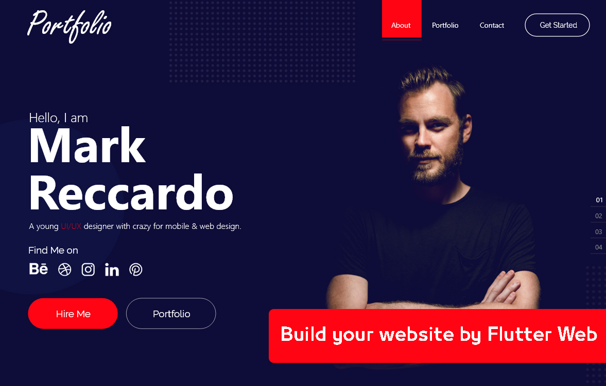

# Your-Portfolio-Website 💻 

It's a good tutorial that helps you build your portfolio website by flutter web.

## Tutorial
You can watch the tutorial on YouTube to know how to build your portfolio website with Flutter Web.

**Click on this photo**

## Features :dart:
* [x] Free & Open Source
* [x] Very Easy to use
* [x] Cross Platform App (Android - IOS - Web) => We can make it responsive on these devices easily
* [x] Home Screen (App Bar - Hiring - Your Photo)
* [x] Route to about screen
* [ ] Alert Dialog for hiring
* [ ] Finish about screen
* [ ] Finish portfolio screen
* [ ] Finish contact screen

## Star it!
Please :star: this repo to help us improve the quality.

## Preview (screenshot) 🎥 

## Language & Framework
* Dart
* Flutter

## Contribtuing 💡
1. Download the repository files (project) from the download section or clone this project by typing in the bash the following command:

       git clone https://github.com/TarekAlabd/Your-Portfolio-Website.git
2. Open this project on Android Studio or visual studio (as you want).
3. Run the app on the emulator or simulator.
4. Edit and add what you want.
For sure, your pull requests is welcomed. 😃 

## Contact me ☎️ 
LinkedIn: [Tarek Alabd](https://linkedin.com/in/TarekAlabd)  
Twitter: [@TarekAlabd](https://twitter.com/TarekAlabd)
