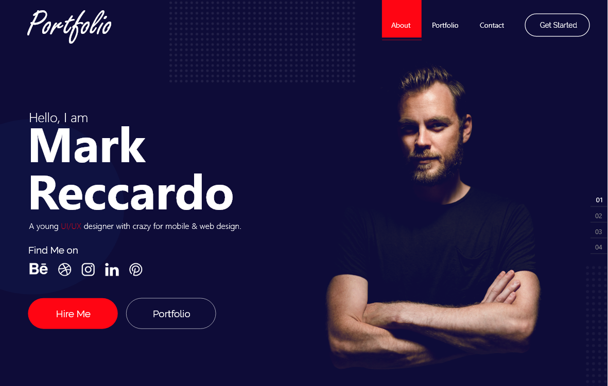

# Your-Portfolio-Website 💻 

It's a good tutorial that helps you build your portfolio website by flutter web.

## Features :dart:
* [x] Free & Open Source
* [x] Very Easy to use
* [x] Cross Platform App (Android - IOS - Web) => We can make it responsive on these devices easily
* [x] Home Screen (App Bar - Hiring - Your Photo)
* [x] Route to about screen
* [ ] Alert Dialog for hiring
* [ ] Finish about screen
* [ ] Finish portfolio screen
* [ ] Finish contact screen

## Star it!
Please :star: this repo to help us improve the quality.

## Preview (screenshot) 🎥 
 |

